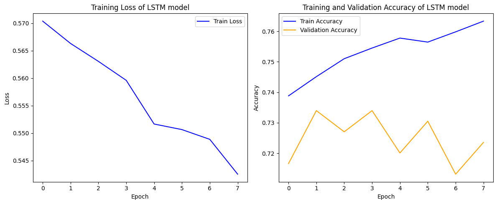
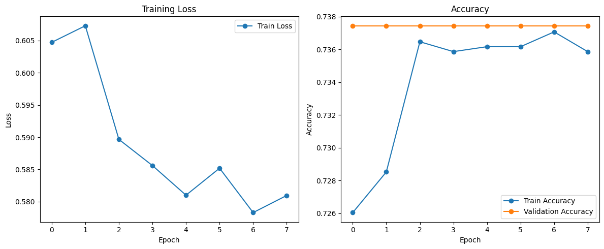
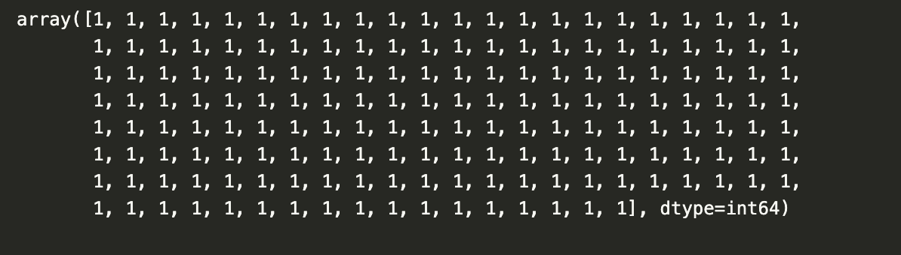
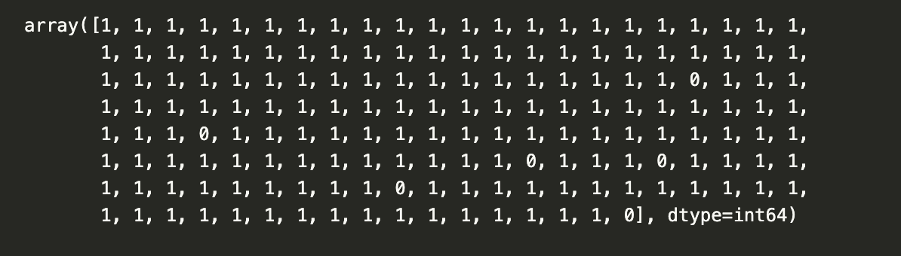

# imdb_spoiler

This is the group project for [INMAS](https://inmas.us/about) Workshop 4. In this project, we explored various aspect of the [IMDB Spoiler Dataset](https://www.kaggle.com/datasets/rmisra/imdb-spoiler-dataset?resource=download), and trained/fine-tuned various models on part of/ whole dataset.

The dataset is high-quality and carefully curated, and is collected from IMDB. It contains metadata of movies,  user-generated movie reviews, as well as information regarding wether a review contains a spoiler or not. There are two json files in the dataset. The first file `IMDB_movie_details.json` contains metadata of movies, and has the following attributes

`movie_id`: Unique id of the movie/tv-show.

`plot_summary`: Plot summary of the item. Does not contain spoilers.

`duration`: Item runtime duration.

`genre`: Associated genres.

`rating`: Overall rating for the item.

`release_date`: The release date of the item.

`plot_synopsis`: Synopsis of item's plot. Contains spoiler content.

The second file `IMDB_reviews.json` contains user reviews on the movies in `IMDB_movie_details.json`, as well as information like wether a review contains spoiler. The attributes in the file are

`review_date`: Date the review was written.

`movie_id`: Unique id for the item.

`user_id`: Unique id for the review author.

`is_spoiler`: Indication whether review contains a spoiler.

`review_text`: Text review about the item.

`rating`: Rating given by the user to the item.

`review_summary`: Short summary of the review.

## Requirements and Setting up Python Virtual Environment

Suppose we have `python >= 3.12.x` installed on local machine (most of our team members' laptops are MacBooks).

1. Create a virtual environment for this project, in my laptop, I name it `env_torch` but you can choose any name you like. I put it in the folder `~/.venvs`, which is created by me

   ```bash
   python3 -m venv ~/.venvs/env_torch
   ```
2. Activate the `env_torch` virtual environment

   ```bash
   source ~/.venvs/env_torch/bin/acivate
   ```
3. Install all python modules needed

   ```bash
   pip install torch torchvision torchaudio
   pip install nltk
   pip install 'kagglehub[pandas-datasets]' # the single quotes are important because Zsh treats [] as special characters
   pip install ipykernel
   pip install pandas
   pip install tabulate
   pip install matplotlib
   pip install seaborn
   pip install transformers
   ```
4. Set Jupyter Kernel in VS Code. Open VSCode and press `Cmd + Shft + P`, type `python` and choose `select python interpreter` you'll see the interface below. If you don't see it, be patient and press the refresh buttuon and wait. It'll finally appear.


If it still doesn't show up, open terminal and activate `env_torch`, then type

```bash
python -m ipykernel install --user --name=env_torch --display-name "Python (env_torch)"
```

Now in the upper right corner of VSCode, you can see `Select Kernel` option. Click and choose `Python Environments`, and select `env_torch(Python 3.13.2)`


## Load JSON Data File

1. Download the  [IMDB Spoiler Dataset](https://www.kaggle.com/datasets/rmisra/imdb-spoiler-dataset). Click "Download" and choose the option "Download dataset as zip (348 MB)".
2. Unzip the .zip file, and ceate a folder named `data` in the project folder. Move the file `IMDB_reviews.json` (952.6 MB) into the folder data. And set the value of the variable `file_path` as `"data/IMDB_reviews.json"`.

## Downstream Tasks

### Rating Classification and Spoiler Detection

Under the `./synopsis_rating` folder, we performed 2 experiments to explore the ability of LLMs in classification task.

In the python notebook `./synopsis_rating/rating_classification.ipynb` , we performed classification task on `IMDB_movie_details.json` data. We wanted to explore  if LLMs can rate a movie just from its synopsis. Thus, this is a classification task. There are 3 classes in the task, class 0 (movies rated under and including 6/10), class 1 (movies rated from 6/10 to 8/10 but not including 8/10), and class 3 (movies rated from 8/10 to 10/10). The data in this task is movie synopses. The tokenizer and language model used from this task are all pretrained model based on [Longformer](https://huggingface.co/allenai/longformer-base-4096 "link to Longformer")

In the python notebook `./synopsis_rating/spoiler_detection.ipynb`, we used the pretrained model [BERT](https://github.com/google-research/bert "link to BERT") to perform a binary classification on randomly sampled data from `IMDB_reviews.json`. We wanted to know if BERT is able to detect if a review contains spoiler or not. Thus there are only 2 labels in this task, 1 (contains spoiler) and 0 (doesn't contain spoiler). The data in the task is thus the movie reviews, but with urls removed and all letters changed to lowercase.

### Bechmarking Language Models

After performing the spoiler detection task using BERT, we wonder if we can compare the capabilities of spoiler detection of different language models on the same dataset, i.e., benchmarking them. BERT is a good candidate, but what about others?

If we know some history in NLP and AI, we'll know that before the groundbreaking paper [Attention Is All You Need](https://arxiv.org/abs/1706.03762 "link to paper"), [LSTM Model](https://en.wikipedia.org/wiki/Long_short-term_memory#:~:text=Long%20short%2Dterm%20memory%20(LSTM,and%20other%20sequence%20learning%20methods.)) (Long-Short Term Memory Model) was the state of the art in machine translation and NLP. It is based on RNN, and has Encoder-Decoder structure. Transformers appeared later to lower the depth of RNNs, for which the attention mechanism was introduced. And BERT is considered one of the most successful examples of transformer-based models.

After reviewing the history, we wanted to benchmark BERT and it's direct predecessor, LSTM, on our spoiler detection task. All the notebooks and scripts are under the `./benchmark_lms` folder.

We trained/tuned 2 language models, LSTM and BERT to perform the binary classification. The LSTM is trained from scratch, and BERT is a pretrained model. The script for LSTM training is `lstm_train.py`. When you use it, you need to follow the command below (suppose you are in the root directory), where '--batch_size', '--max_len' and '--n_epochs' are desired values for batch size of the dataloaders, length of token embedding and number of training epochs. Also `/path/to/json/file` is the location of the data (you can try `data/sampled_preprocessed.json`).

```bash
python ./benchmark_lms/lstm_train.py /path/to/json/file --batch_size 32 --max_len 256 --n_epochs 8

```

The training history of LSTM is as below



To train/finetune BERT, use the following similar command

```bash
python ./benchmark_lms/bert_train.py /path/to/json/file --batch_size 32 --max_len 256 --n_epochs 8
```

The training process is in below



### Classical Methods

From the previous tasks, we got not-so-bad results from transformer-based models (BERT, Longformer) and RNN-based models (LSTM). But we're not content with that, as classical methods like Tfidf, SVM and cosine similarity from any NLP textbook have left us deep impression. So we wonder, if we can perform classification tasks on the IMDB dataset and test their performance? Of course we can, but this time we need to try something new, something really 'fires' up.

Under the folder `./classical_models`, we performed several tasks classification tasks related to fire.  In `./classical_models/tfidf_classifier.ipynb`, we chose labels, 1 (for movies have some elements related to 'fire', like *Dragon Ball*) and 0 (for movies don't have ), and used `TfidfVectorizer` from `scikit-learn` to vectorize the movie reviews, and then trained 2 classical models on the data: SVM and Decision Tree.

After getting the 2 results of SVM and decision tree  below, we tried to use some new metrics like Jaccard distance and cosine similarity to measure the words in the dataset, and the corresponding results are all in `./classical_models/tfidf_classifier.ipynb`





We also compared the results of classical methods and LSTM in `./classical_models/lstm.ipynb`.


## Contributors

| Name          | Contribution |
|--------------|-------------|
| Chi Zhang     | Benchmarking language models, maitaining github repo |
| Siqi Jiao     | Rating classification, benchmarking language models |
| Yuxuan Zhao   | Benchmarking language models |
| Yutong Duan   | Developing pipelines for classical models in NLP, labeling anime data|
| Howard Chen   | Developing pipelines for classical models in NLP, collecting anime data|