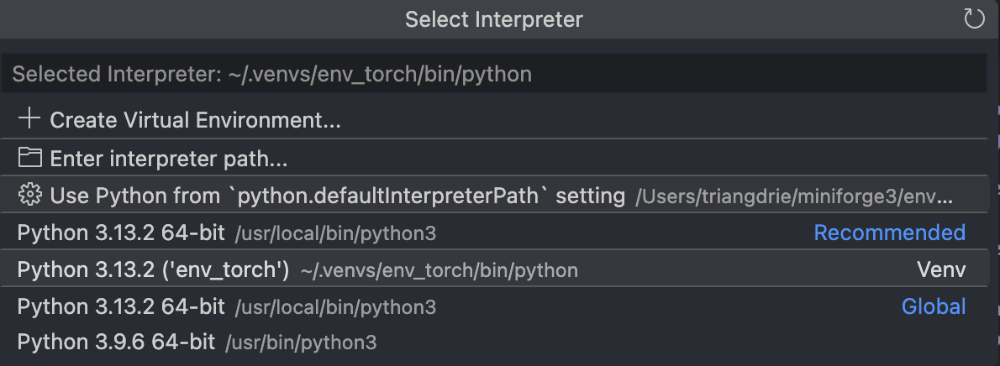
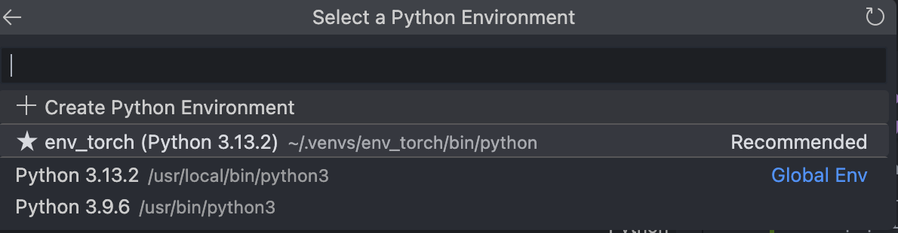

# imdb_spoiler

INMAS Workshop 4 Project


## (Possible)Downstream tasks

1. prediction of spoiler label (Siqi Jiao, Sunny Zhao)
2. Classification
3. Howard: a bare minimum is to create a classifier model that uses movie ratings to predict genres as a training set, and apply it to predict genres based on ratings for anime as a testing set. A more ambitious but time permitting idea is assessing movie ratings depending on if there are characters that use fire in them, hoping to use NLP and perhaps chatbots to more accurately attain information on whether or not a certain movie has a character that uses fire in it


## Configure Python environment

Suppose we have `python >= 3.12.x` installed on local machine. 

1. Create a virtual environment for this project, in my laptop, I name it `env_torch` but you can choose any name you like. I put it in the folder `~/.venvs`, which is created by me

    ```bash
    python3 -m venv ~/.venvs/env_torch
    ```

2. Activate the `env_torch` virtual environment

   ```bash
   source ~/.venvs/env_torch/bin/acivate
   ```

3. Install all python modules needed 

    ```bash
    pip install torch torchvision torchaudio
    pip install nltk
    pip install 'kagglehub[pandas-datasets]' # the single quotes are important because Zsh treats [] as special characters 
    pip install ipykernel

    pip install tabulate

    pip install matplotlib

    pip install seaborn
    ```

4. Set Jupyter Kernel in VS Code. Open VSCode and press `Cmd + Shft + P`, type `python` and choose `select python interpreter` you'll see the interface below. If you don't see it, be patient and press the refresh buttuon and wait. It'll finally appear. 



If it still doesn't show up, open terminal and activate `env_torch`, then type 

```bash
python -m ipykernel install --user --name=env_torch --display-name "Python (env_torch)"
```

Now in the upper right corner of VSCode, you can see `Select Kernel` option. Click and choose `Python Environments`, and select `env_torch(Python 3.13.2)`



## Load JSON Data File 

1. Download the  [IMDB Spoiler Dataset](https://www.kaggle.com/datasets/rmisra/imdb-spoiler-dataset). Click "Download" and choose the option "Download dataset as zip (348 MB)". 

2. Unzip the .zip file, and ceate a folder named `data` in the project folder. Move the file `IMDB_reviews.json` (952.6 MB) into the folder data. And set the value of the variable `file_path` as `"data/IMDB_reviews.json"`. 